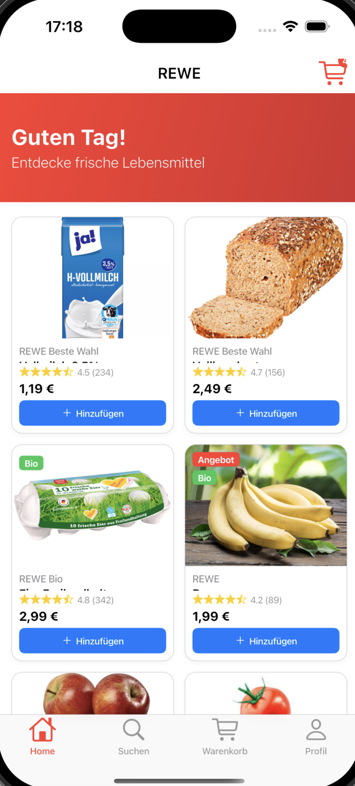

# REWE App Clone

A Flutter-based iOS shopping application inspired by the REWE grocery shopping app. This app provides a modern mobile shopping experience with product browsing, cart management, and user authentication features.

## Features

- **Product Catalog**: Browse through various grocery products with detailed information
- **Shopping Cart**: Add, remove, and manage items in your shopping cart
- **Category Navigation**: Explore products by different categories
- **User Authentication**: Secure login and registration system
- **Product Search**: Find products quickly with search functionality
- **Local Storage**: Offline data caching for better performance

## Screenshots

<div align="center">
  
  
  
</div>

## Tech Stack

- **Framework**: Flutter 3.10+
- **Language**: Dart 3.0+
- **State Management**: Riverpod with Hooks
- **Data Models**: Freezed for immutable data classes
- **Storage**: Hive for local data persistence
- **Networking**: Dio for HTTP requests
- **Security**: Flutter Secure Storage for sensitive data
- **UI**: Custom components with Cupertino design

## Platform Support

- ✅ iOS (Primary target)
- ❌ Android (Not supported in this version)
- ❌ Web (Not supported in this version)

## Getting Started

### Prerequisites

- Flutter SDK (3.10.0 or higher)
- Dart SDK (3.0.0 or higher)
- Xcode (for iOS development)
- iOS Simulator or physical iOS device

### Installation

1. Clone the repository:
   ```bash
   git clone https://github.com/dejvi1-tech/ReweAppCloneIOS.git
   cd ReweAppCloneIOS
   ```

2. Install dependencies:
   ```bash
   flutter pub get
   ```

3. Generate code (for Freezed models):
   ```bash
   flutter packages pub run build_runner build
   ```

4. Run the app:
   ```bash
   flutter run -d "iPhone Simulator"
   ```

## Dependencies

### Core Dependencies
- `hooks_riverpod` - State management
- `flutter_hooks` - React-style hooks for Flutter
- `freezed` - Code generation for data classes
- `dio` - HTTP client
- `hive` - NoSQL database for Flutter

### UI Dependencies
- `cached_network_image` - Image caching and loading
- `cupertino_icons` - iOS-style icons

## Development

### Code Generation

This project uses code generation for data models. After making changes to Freezed models, run:

```bash
flutter packages pub run build_runner build --delete-conflicting-outputs
```

### Running Tests

```bash
flutter test
```

## Contributing

1. Fork the repository
2. Create your feature branch (`git checkout -b feature/amazing-feature`)
3. Commit your changes (`git commit -m 'Add some amazing feature'`)
4. Push to the branch (`git push origin feature/amazing-feature`)
5. Open a Pull Request

## License

This project is created for educational purposes and is not affiliated with REWE Group.
